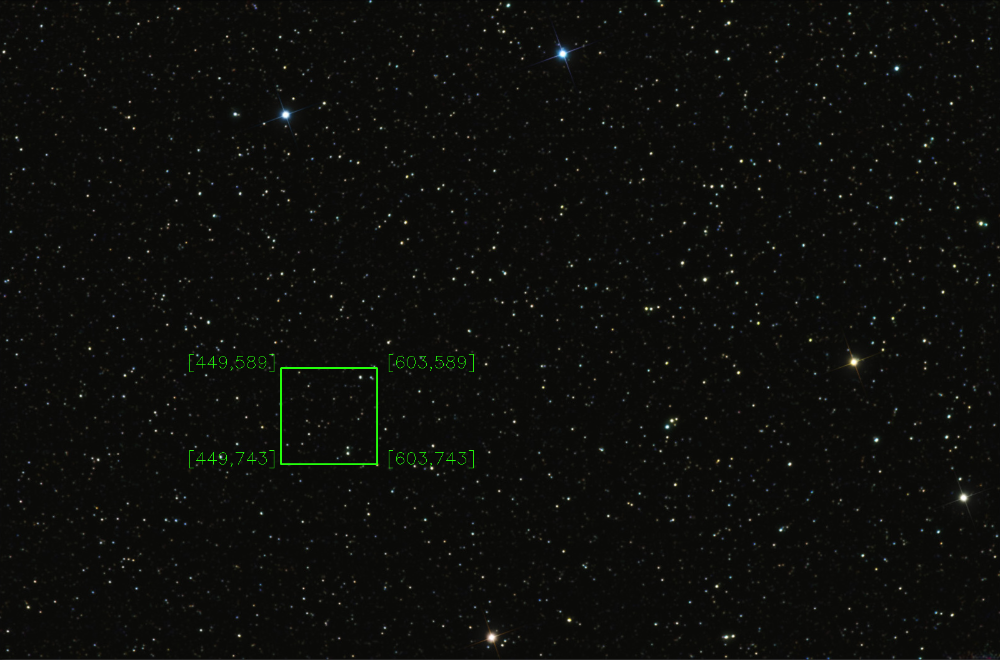
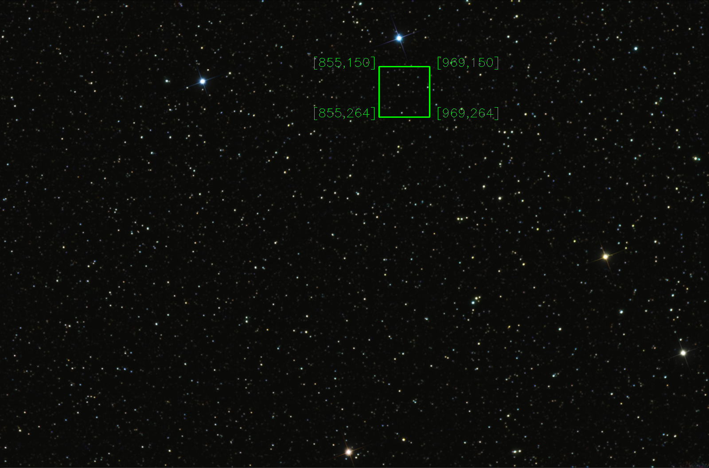

# Locating a Defined Area in the Star Map
In this study, it is aimed to find the position of a picture given as a template in the reference picture.

## Approach
As a method, the **correlation coefficient template matching** approach was preferred and extra **warpaffine** was applied to find the rotated images.The application is coded in **cpp** and **python** languages. 

## System And Library Versions

- OS : Ubuntu 20.04 LTS
- Python Version: 3.8
- g++ Version:8.4
- Opencv Version : 4.5

## Application
To run a **python** code, use:

```sh
python3 template_match.py --reference src/StarMap.png --template src/Small_area_rotated.png --threshold 0.7

```
To run a **cpp** code, use:
```sh
g++ template_match.cpp `pkg-config opencv --cflags --libs` -lopencv_core -lopencv_highgui -o template_match
```
```sh
./template_match src/StarMap.png src/Small_area_rotated.png 0.7
```
### Outputs




## Author
-  Muhammet Taha AYDIN
## Contact
- m.tahaydin@outlook.com
